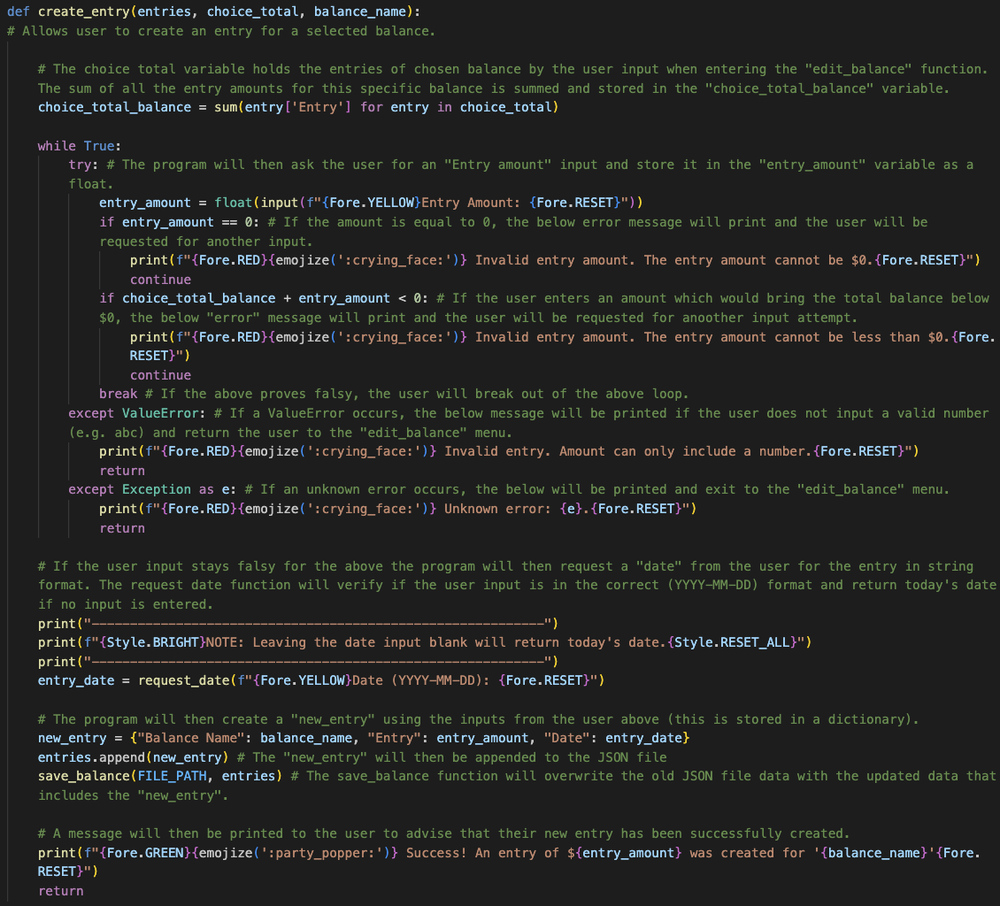
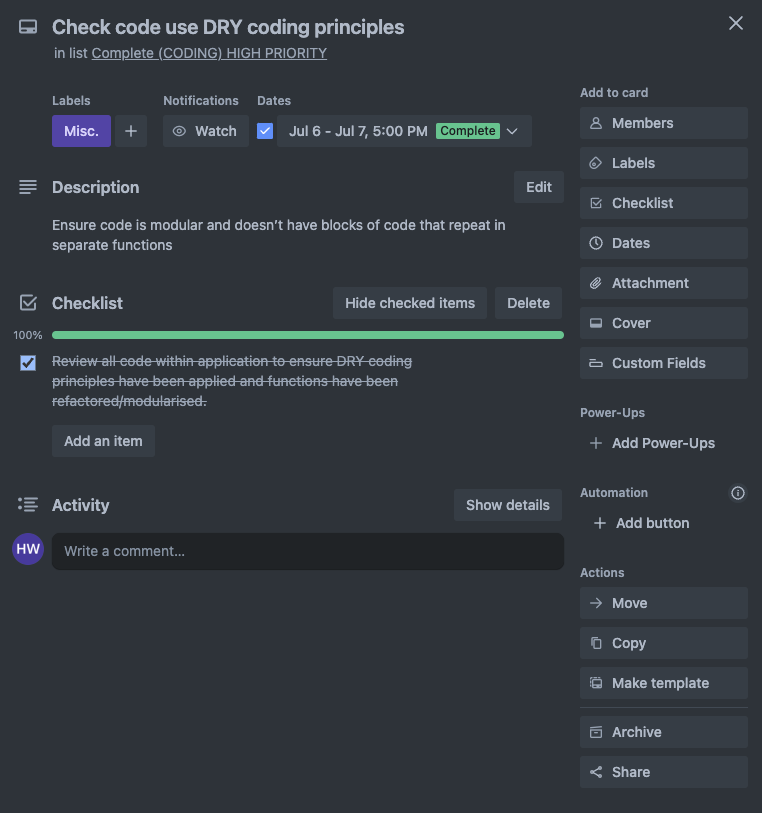

# T1A3: Terminal Application (Debt Tracker 🎯)

Welcome to the documentation of Hendric Widjaja's - T1A3: Terminal Application.

# Quick Links

Please use the links below to quickly access key parts of this documentation

- [Link to source control repository (GitHub)](#source-control-repository)
- [Code Style Guide / Styling Conventions (PEP8)](#code-style-guide--styling-conventions-pep8)
- [Application Features](#application-features)
    - [Main Features](#main-features)
        - Create Balance
        - Delete Balance
        - Create Entry
        - Delete Entry
        - Calculate Amount
        - Calculate Date
    - [Other Features](#other-features)
- [Implementation Plan (Trello)](#implementation-plan-trello)
- [Help Documentation](#help-documentation)

## Source Control Repository
Please find the link to the source control repository for this application below:
[https://github.com/hendricwidjaja/HendricWidjaja_T1A3](https://github.com/hendricwidjaja/HendricWidjaja_T1A3)

## Code Style Guide / Styling Conventions (PEP8)
The [PEP8 Style Guide for Python Code](https://peps.python.org/pep-0008/#indentation) (written by Guido van Rossum, Barry Warsaw & Alyssa Coghlan) was implemented for the writing of this application's code. The review of this implementation was conducted manually and made to ensure that the following styling was allowed for:
- Imports to be located at the top of each file
- Imports to be grouped by standard, 3rd party and local application
- 4 spaces per indentation level
- 79 character maximum line limit (where applicable)
- 72 character maximum line limit for long blocks (where applicable)
- Consistency of hanging indent application for continuation lines
- Snake case with lower characters for all variable (e.g. snake_case)
- Upper case with underscores for all constants (e.g. UPPER_CASE)
- Consistency of 2x blank lines between functions
- Consistency of 1x blank where necessary to break up code blocks
- Consistency of double quotes for all strings (if possible)
- Ensure use of white-space characters are consistent and avoided:
    - immediately inside parentheses, brackets or braces
    - between trailing commas,
    - before commas, semicolon or colon
    - immediately before open parenthesis
- Descriptive variable names

## Application Features
There are several features within this application which can be broken down into the below categories. A brief description for each function has been provided for clarification, however the main features will be explained in greater depth.

<b>NOTE:</b> If any images of functions are difficult to see, please refer to the [main functions folder](./docs/main_functions/) within the zip file.

### Main Features

<i><b>NOTE:</b> No explanations will be provided for coloured text (Colorama) or emojis (Emoji). The implementation of these have been for the sole purpose of aesthetics and UX/UI design.</i>

<b>Main Features</b> (Core functions which require various inputs from the user to either update data files or provide a calculated output)
- Create Balance Function
    - This function allows the creation of an entirely new balance into the JSON file. It will require various user input such as “Balance Name”, “Balance amount” and “Date” of entry. It will ensure that the user input is inserted into the JSON file in the correct format. Please see detailed breakdown of function below with inline comments:

    

- Delete Balance Function
    - This function is a main feature and will allow the user to delete a specific balance from the JSON file. As it cannot be undone, it will require a confirmation from user that they want to delete the specific balance. It will require user input to enter the balance name they want to delete and rewrite the JSON file with a new list which does not contain the specified balance name entries. Please see detailed breakdown of function below with inline comments:

    

- Create Entry Function
    - This main feature allows the user to create a new entry for a specified balance. This is done by requesting inputs from the user such as “date” of entry and “entry amount”. The program will append this new entry into the JSON file and save/overwrite this as the new updated file. A message will then be printed to the user to advise if the entry was entered successfully. Please see detailed breakdown of function below with inline comments:

    
    
- Delete Entry Function
    - The main feature allows the user to delete an entry from the JSON file for a pre-specified balance. The function firstly prints all the entries for the specified balance with its corresponding index (as well as “date” of entry and “entry amount”). It will then request an index number as an input from the user to be deleted. The corresponding entry of the index number will then be removed from the JSON file and the updated file will be saved/overwritten without the deleted entry. A message will then be printed to the user that the specific entry has been deleted. Please see detailed breakdown of function below with inline comments:

    

- Calculate Amount Function
    - The function allows the user to calculate the payment amount required to pay off a debt by a certain date, based off a recurring payment frequency. This is done by requesting inputs from the user (recurring payment frequency and date of when the debt needs to be paid off). Further calculations (using basic algebra) are then completed by the script to output a payment amount. These calculations utilise datetime & math modules/functions. Please see detailed breakdown of function below with inline comments:

    

- Calculate Date Function
    - The function allows the user to calculate the date that a debt will be paid off based off a recurring payment amount and frequency. This is done by requesting inputs from the user (recurring payment frequency and payment amount). Further calculations (using basic algebra) are then completed by the script to output a payment date. These calculations utilise datetime & math modules/functions. Please see detailed breakdown of function below with inline comments:

    

### Other Features

<b><u>Main menus</u></b> (functions which display choices to the user that allow them to provide input to access different functions)
- Menu #1: Main Menu
    - Create a main menu for the user to allow them to navigate through the application providing opportunity for user input.
- Menu #2: Edit/View Balance Menu
    - Creates a menu for the user to edit and view a specific balance. The menu includes:
        - Creating an entry
        - Deleting an entry
        - Going back to main menu
    - Menu also prints a summary of specific balance to allow easier choice making for the user.
- Menu #3: Debt Calculator Menu
    - Debt calculator menu provides options for the user to calculate debt of specific balance with the below options:
        - Allow user to calculate the payment amount required to pay off a debt by a certain date, based off a recurring payment frequency
        - Allow user to calculate the date that a debt will be paid off based off a recurring payment amount and frequency
    - Menu also includes helpful text to identify the meaning of “frequency options”, etc.

<b><u>Sub-functions</u></b> (functions which have been modularised to allow for the implementation of DRY Coding Principles)
- Load Balance
    - This sub-function is not a main feature but is crucial to the functionality of many functions which involve access to the JSON file to view or edit entries.
- Save Balance
    - This sub-function is not a main feature but is crucial to the functionality of various other functions. This function will allow the overwriting of the JSON file with updated entries based of user choice of deletion or addition.
- Create Balance Summaries
    - This sub-function allows functionality of other functions within the program. It’s main purpose is to be modular so that it can be reused when the program requires to create a summary list of chosen balances.
- Calculate Total Balance
    - This sub-function has been modularised and forms as a function with the balance_summaries function. It allows for the extraction of “balance name” and “balance amounts” from the JSON file for all entries.
- Request Date
    - This function is used in various other functions to allow the program to request a date input form the user. It will handle all error handling for the date input ensuring it is in the correct format.
- Account Balance Entries
    - This sub-function is utilised in various other functions and is modularised to retrieve the specific entries in the JSON file which match the “balance name” specified by the user.
- Balance History
    - This sub-function has been modularised for the sole purpose of printing the entries for a specified balance which is chosen by the user. It will only print the “date” of the entries and the “entry amount” for a specific balance. This sub-function is only utilised to provide the user the information they require to select if they want to remove or create an entry for the specified balance (Edit/View menu).

## Implementation Plan (Trello)
Please find the link to the Trello board for this application below:
[https://trello.com/invite/b/XUAi4Y6a/ATTIc457de7463b016fe6016a00fdc8535abB3E00757/t1a3-terminal-application](https://trello.com/invite/b/XUAi4Y6a/ATTIc457de7463b016fe6016a00fdc8535abB3E00757/t1a3-terminal-application)

### Screenshots of each Trello card for the coding of this application are as per below
This includes:
- outlines of how each feature will be implemented and a checklist of tasks for each feature
- prioritise the implementation of different features or checklist items within a feature
- provide a deadline, duration or other time indicator for each feature or checklist-item

<b>NOTE:</b> If any images of functions are difficult to see, please refer to the [Trello folder](./docs/Trello/) within the zip file.

## Help Documentation

### Important Notes
This documentation has been written for the purpose of providing information regarding:
- Steps to install the application
- Dependencies required by the application to operate
- Any system/hardware requirements
- How to use any command line arguments made for this application